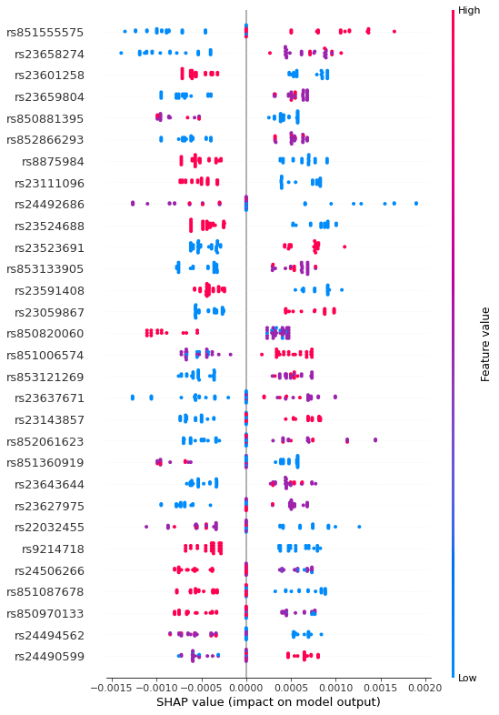

# This notebook presents application of Random Forest and SHAP values for selection of candidate SNPs from whole genome sequencing procedure

### Application of feature selection with Random Forest algorythm in searching of promising single nucleotide polymorphism (SNPs) for obesity markers in in Labrador Retriever breed


```python
import pandas as pd
import numpy as np
import h5py
from statistics import mean, stdev
from numpy import median

import matplotlib.pyplot as plt
from matplotlib.ticker import MaxNLocator
from matplotlib.axes import Axes

import seaborn as sns
%matplotlib inline

from sklearn.model_selection import train_test_split
from sklearn.ensemble import RandomForestClassifier
from sklearn import metrics
from sklearn.metrics import plot_roc_curve
from sklearn.model_selection import StratifiedKFold, cross_val_score
from sklearn.metrics import auc, roc_auc_score, precision_recall_curve
import re
import shap
```

#### Input data
Input data consisted of variants stored in **.vcf** format. Initial step consisted of preprocessing data with **VCFtools - 0.1.15** (https://vcftools.github.io/man_latest.html)

#### VCFtools - 0.1.15 log and filtering parameters

#### log:
Parameters as interpreted:
	--maf 0.05
	--max-alleles 2
	--hwe 0.05
	--max-missing 1
	--out snp_filtered
	--recode
	--remove-filtered-all

Using zlib version: 1.2.11
After filtering, kept 50 out of 50 Individuals
Outputting VCF file...
After filtering, kept 7449322 out of a possible 13634925 Sites
Run Time = 946.00 seconds

#### Conversion to 012 format where:
* 0 - both reference alleles
* 1 - one non-reference allele
* 2 - two non-reference alleles

#### log:
Parameters as interpreted:
	--vcf snp_filtered.recode.vcf
	--012

After filtering, kept 50 out of 50 Individuals
Writing 012 matrix files ... Done.
After filtering, kept 7449322 out of a possible 7449322 Sites
Run Time = 93.00 seconds

Dataframe generated in previous step was converted to .h5 format and filtered for snps with rs codes using **gen_to_hdf5.py** script. Overall, 2971332 snps remained.


Remaining snps were annotated with **Variant Effect Predictor (VEP)** (https://pubmed.ncbi.nlm.nih.gov/20562413/) using CanFam 3.1 reference genome

VEP parameters:
./vep --appris --biotype --buffer_size 5000 --check_existing --coding_only --distance 5000 --mane --sift b --species canis_lupus_familiaris --tsl --cache --input_file [input_data] --output_file [output_file]


```python
snp_info = pd.read_csv('../input/all_snp_ensembl.txt',sep='\t')
snp_id = np.unique(snp_info.iloc[:,0])
snp_id.shape
```


    (2971332,)


### Consequences estimated by VEP


```python
snp_info.groupby('Consequence').count().iloc[:,1]
```


    Consequence
    -                                                                 2931420
    coding_sequence_variant                                                15
    coding_sequence_variant,3_prime_UTR_variant                             2
    coding_sequence_variant,5_prime_UTR_variant                             2
    frameshift_variant                                                    864
    frameshift_variant,intron_variant                                       2
    frameshift_variant,splice_region_variant                               25
    frameshift_variant,splice_region_variant,intron_variant                 2
    frameshift_variant,start_lost                                           2
    frameshift_variant,start_lost,splice_region_variant                     1
    frameshift_variant,start_lost,start_retained_variant                    6
    frameshift_variant,stop_lost                                            7
    frameshift_variant,stop_retained_variant                                5
    inframe_deletion                                                      569
    inframe_deletion,splice_region_variant                                 12
    inframe_insertion                                                     414
    inframe_insertion,splice_region_variant                                 9
    inframe_insertion,stop_retained_variant                                 1
    missense_variant                                                    31084
    missense_variant,splice_region_variant                                651
    protein_altering_variant                                                9
    splice_acceptor_variant,coding_sequence_variant                         1
    splice_acceptor_variant,coding_sequence_variant,intron_variant          3
    splice_acceptor_variant,missense_variant                                2
    splice_acceptor_variant,synonymous_variant                              1
    splice_donor_variant,coding_sequence_variant                            2
    splice_donor_variant,coding_sequence_variant,intron_variant             5
    splice_donor_variant,missense_variant                                   2
    splice_region_variant,synonymous_variant                             1115
    start_lost                                                            107
    start_lost,inframe_deletion                                             1
    start_lost,splice_region_variant                                        1
    start_lost,start_retained_variant,5_prime_UTR_variant                   1
    stop_gained                                                           260
    stop_gained,frameshift_variant                                          2
    stop_gained,splice_region_variant                                       7
    stop_gained,start_lost                                                  1
    stop_lost                                                              46
    stop_lost,splice_region_variant                                         3
    stop_retained_variant                                                  19
    stop_retained_variant,3_prime_UTR_variant                               1
    synonymous_variant                                                  53705
    Name: Location, dtype: int64


```python
### Loading variants
X = pd.read_hdf('../input/out.012.h5')
```


```python
snp = X
columns = snp.iloc[1]
snp = snp.iloc[2:]
snp.columns=columns
snp.iloc[0:5,0:5]
```


<div>
<style scoped>
    .dataframe tbody tr th:only-of-type {
        vertical-align: middle;
    }

    .dataframe tbody tr th {
        vertical-align: top;
    }

    .dataframe thead th {
        text-align: right;
    }
</style>
<table border="1" class="dataframe">
  <thead>
    <tr style="text-align: right;">
      <th>rsid</th>
      <th>rs851026873</th>
      <th>rs850896350</th>
      <th>rs851186727</th>
      <th>rs852900184</th>
      <th>rs852599909</th>
    </tr>
    <tr>
      <th>0</th>
      <th></th>
      <th></th>
      <th></th>
      <th></th>
      <th></th>
    </tr>
  </thead>
  <tbody>
    <tr>
      <th>0</th>
      <td>0</td>
      <td>2</td>
      <td>0</td>
      <td>0</td>
      <td>0</td>
    </tr>
    <tr>
      <th>1</th>
      <td>0</td>
      <td>2</td>
      <td>0</td>
      <td>0</td>
      <td>0</td>
    </tr>
    <tr>
      <th>2</th>
      <td>0</td>
      <td>2</td>
      <td>0</td>
      <td>0</td>
      <td>0</td>
    </tr>
    <tr>
      <th>3</th>
      <td>0</td>
      <td>2</td>
      <td>0</td>
      <td>0</td>
      <td>0</td>
    </tr>
    <tr>
      <th>4</th>
      <td>0</td>
      <td>2</td>
      <td>0</td>
      <td>0</td>
      <td>1</td>
    </tr>
  </tbody>
</table>
</div>


```python
#### Shape of the input array (50 dogs & 2971332 snps)
X = np.array(snp)
X.shape
```


    (50, 2971332)


```python
labels = pd.read_csv('../input/labels.tsv',sep='\t',header=0) 
y = labels.iloc[:,2]

label_list = [0,1]
label_list2 = ['Healthy','Obese']
label_sum = 0

print('Number of animals per label:')
for i in range(len(label_list)):
    label_count=sum(y==label_list[i])
    print(label_list2[i]+': '+str(label_count))
    label_sum=label_sum+label_count
print('Total number of animals: '+str(label_sum))
```

    Number of animals per label:
    Healthy: 22
    Obese: 28
    Total number of animals: 50


```python
#### Training model

n_estimators=500
min_samples_split=10
min_samples_leaf=10
max_features=500
max_depth=None
bootstrap=False

print('Hyperparameters:')
print('No. of estimators: '+ str(n_estimators))
print('Min. number of samples per split: '+ str(min_samples_split))
print('Min. number of samples per leaf: '+ str(min_samples_leaf))
print('Max. number of features per tree: '+ str(max_features))
print('Max. depth: '+ str(max_depth))


clf = RandomForestClassifier(bootstrap=bootstrap, class_weight=None, criterion='gini',
        max_depth=max_depth, max_features=max_features, max_leaf_nodes=None,
        min_impurity_decrease=0.0, min_impurity_split=None,
        min_samples_leaf=min_samples_leaf, min_samples_split=min_samples_split,
        min_weight_fraction_leaf=0.0, n_estimators=n_estimators, n_jobs=-1,
        oob_score=False, verbose=0,random_state=42, 
        warm_start=False)

prs = []
aucs = []
mean_recall = np.linspace(0, 1, 100)

plt.figure(figsize=(18 , 13))
i = 0

feature_imp = []
list_shap_values = []
list_test_sets = []

kfold_splits = 5
skf = StratifiedKFold(n_splits=kfold_splits, shuffle=True, random_state=0)
clf_accu_stratified = [] 

for index, (train_index, test_index) in enumerate(skf.split(X, y)):
    print("\nTraining on fold " + str(index+1) + "/"+str(kfold_splits)+":")

    X_train, X_test = X[train_index], X[test_index]
    y_train, y_test = y.iloc[train_index], y.iloc[test_index]
    
    y_train, y_test = y_train, y_test
    
    clf.fit(X_train,y_train)
    
    
    explainer = shap.TreeExplainer(clf)
    shap_values = explainer.shap_values(X_test)

    list_shap_values.append(shap_values)
    list_test_sets.append(test_index)
    
    clf_accu_stratified.append(clf.score(X_test, y_test)) 
    
    y_pred=clf.predict(X_test)
    print('Fold ' + str(index+1) + " accuracy:",metrics.accuracy_score(y_test, y_pred))
     # Compute PR curve and area the curve
    precision, recall, thresholds = precision_recall_curve(y_test, y_pred)
    prs.append(np.interp(mean_recall, precision, recall))
    pr_auc = auc(recall, precision)
    aucs.append(pr_auc)
    plt.plot(recall, precision, lw=3, alpha=0.5, label='Fold %d (AUCPR = %0.2f)' % (i+1, pr_auc))
    i += 1

plt.plot([0, 1], [1, 0], linestyle='--', lw=3, color='k', label='Chance', alpha=0.8)
mean_precision = np.mean(prs, axis=0)
mean_auc = auc(mean_recall, mean_precision)
std_auc = np.std(aucs)
plt.plot(mean_precision, mean_recall, color='navy',
     label=r'Mean (AUCPR = %0.3f $\pm$ %0.2f)' % (mean_auc, std_auc),
     lw=4)


plt.xlim([-0.05, 1.05])
plt.ylim([-0.05, 1.05])
plt.xlabel('Recall' ,  fontweight = "bold" , fontsize=30)
plt.ylabel('Precision',fontweight = "bold" , fontsize=30)
plt.tick_params(axis='both', which='major', labelsize=20)
plt.legend( prop={'size':20} , loc = 0)
# if saveFigPath:
# plt.savefig(F"./{saveFigPath}.pdf" ,bbox_inches='tight')
plt.show()

print('List of possible accuracies:', clf_accu_stratified) 
print('\nMaximum Accuracy That can be obtained from this model is:', 
      max(clf_accu_stratified)*100, '%') 
print('\nMinimum Accuracy:', 
      min(clf_accu_stratified)*100, '%') 
print('\nOverall Accuracy:', 
      mean(clf_accu_stratified)*100, '%') 
print('\nStandard Deviation is:', stdev(clf_accu_stratified))
```

    Hyperparameters:
    No. of estimators: 500
    Min. number of samples per split: 10
    Min. number of samples per leaf: 10
    Max. number of features per tree: 500
    Max. depth: None
    
    Training on fold 1/5:
    Fold 1 accuracy: 0.6
    
    Training on fold 2/5:
    Fold 2 accuracy: 0.5
    
    Training on fold 3/5:
    Fold 3 accuracy: 0.6
    
    Training on fold 4/5:
    Fold 4 accuracy: 0.8
    
    Training on fold 5/5:
    Fold 5 accuracy: 0.6


    

    


    List of possible accuracies: [0.6, 0.5, 0.6, 0.8, 0.6]
    
    Maximum Accuracy That can be obtained from this model is: 80.0 %
    
    Minimum Accuracy: 50.0 %
    
    Overall Accuracy: 62.0 %
    
    Standard Deviation is: 0.10954451150103325


```python
#combining results from all iterations
test_set = list_test_sets[0]
shap_values = np.array(list_shap_values[0])
for i in range(1,len(list_test_sets)):
    test_set = np.concatenate((test_set,list_test_sets[i]),axis=0)
    shap_values = np.concatenate((shap_values,np.array(list_shap_values[i])),axis=1)
#bringing back variable names    
X_test = pd.DataFrame(X[test_set],columns=columns)
```


```python
#creating explanation plot for top 30 snps
shap.summary_plot(shap_values[1], X_test, max_display=30)
```


    

    


```python
shap_sum = np.abs(shap_values[1]).mean(axis=0)
importance_df = pd.DataFrame([X_test.columns.tolist(), shap_sum.tolist()])
importance_df = {'SNP':X_test.columns, 'mean_abs_shap_importance':shap_sum}
importance_df = pd.DataFrame(importance_df)
importance_df = importance_df.loc[importance_df['mean_abs_shap_importance'] > 0]
importance_df = importance_df.sort_values('mean_abs_shap_importance', ascending=False)
importance_df.to_csv('../output/allsnp_list.txt',header=True, index=False, sep='\t')
print('\nFiltering SNPs with absolute SHAP importance > 0:')
print(str(len(importance_df))+ ' SNPs remained')
```

    
    Filtering SNPs with absolute SHAP importance > 0:
    4320 SNPs remained


```python
importance_df.to_csv('../output/snp_SHAP_filtered.csv', sep='\t',index=False)
```


```python
### Filtering SNPs array for absolute SHAP importance > 0
snp_ind = snp.columns & importance_df.iloc[:,0]
snp_filtered = snp.loc[:,snp_ind.values]
snp_filtered.shape
```


    (50, 4320)


```python
snp_info = snp_info
snp_info_filtered = snp_info[snp_info.loc[:,'#Uploaded_variation'].isin(importance_df.loc[:,'SNP'])]
snp_info_merged = snp_info_filtered.merge(importance_df, left_on='#Uploaded_variation',right_on='SNP', copy=False)
snp_info_merged = snp_info_merged.sort_values(by=['mean_abs_shap_importance'], ascending=False)
snp_info_merged = snp_info_merged.drop(['SNP'],axis=1)
snp_info_merged.to_csv('../output/filtered_snp_list.csv', sep='\t',index=False)
snp_info_merged.head()
```


<div>
<style scoped>
    .dataframe tbody tr th:only-of-type {
        vertical-align: middle;
    }

    .dataframe tbody tr th {
        vertical-align: top;
    }

    .dataframe thead th {
        text-align: right;
    }
</style>
<table border="1" class="dataframe">
  <thead>
    <tr style="text-align: right;">
      <th></th>
      <th>#Uploaded_variation</th>
      <th>Location</th>
      <th>Allele</th>
      <th>Consequence</th>
      <th>IMPACT</th>
      <th>SYMBOL</th>
      <th>Gene</th>
      <th>Feature_type</th>
      <th>Feature</th>
      <th>BIOTYPE</th>
      <th>...</th>
      <th>HGNC_ID</th>
      <th>MANE</th>
      <th>TSL</th>
      <th>APPRIS</th>
      <th>ENSP</th>
      <th>SIFT</th>
      <th>CLIN_SIG</th>
      <th>SOMATIC</th>
      <th>PHENO</th>
      <th>mean_abs_shap_importance</th>
    </tr>
  </thead>
  <tbody>
    <tr>
      <th>2046</th>
      <td>rs851555575</td>
      <td>23:35607138-35607142</td>
      <td>-</td>
      <td>-</td>
      <td>-</td>
      <td>-</td>
      <td>-</td>
      <td>-</td>
      <td>-</td>
      <td>-</td>
      <td>...</td>
      <td>-</td>
      <td>-</td>
      <td>-</td>
      <td>-</td>
      <td>-</td>
      <td>-</td>
      <td>-</td>
      <td>-</td>
      <td>-</td>
      <td>0.000765</td>
    </tr>
    <tr>
      <th>2744</th>
      <td>rs23658274</td>
      <td>30:3980630-3980630</td>
      <td>-</td>
      <td>-</td>
      <td>-</td>
      <td>-</td>
      <td>-</td>
      <td>-</td>
      <td>-</td>
      <td>-</td>
      <td>...</td>
      <td>-</td>
      <td>-</td>
      <td>-</td>
      <td>-</td>
      <td>-</td>
      <td>-</td>
      <td>-</td>
      <td>-</td>
      <td>-</td>
      <td>0.000754</td>
    </tr>
    <tr>
      <th>2602</th>
      <td>rs23601258</td>
      <td>3:46180938-46180938</td>
      <td>-</td>
      <td>-</td>
      <td>-</td>
      <td>-</td>
      <td>-</td>
      <td>-</td>
      <td>-</td>
      <td>-</td>
      <td>...</td>
      <td>-</td>
      <td>-</td>
      <td>-</td>
      <td>-</td>
      <td>-</td>
      <td>-</td>
      <td>-</td>
      <td>-</td>
      <td>-</td>
      <td>0.000623</td>
    </tr>
    <tr>
      <th>2731</th>
      <td>rs23659804</td>
      <td>30:3896482-3896482</td>
      <td>-</td>
      <td>-</td>
      <td>-</td>
      <td>-</td>
      <td>-</td>
      <td>-</td>
      <td>-</td>
      <td>-</td>
      <td>...</td>
      <td>-</td>
      <td>-</td>
      <td>-</td>
      <td>-</td>
      <td>-</td>
      <td>-</td>
      <td>-</td>
      <td>-</td>
      <td>-</td>
      <td>0.000617</td>
    </tr>
    <tr>
      <th>3355</th>
      <td>rs850881395</td>
      <td>38:1595442-1595444</td>
      <td>-</td>
      <td>-</td>
      <td>-</td>
      <td>-</td>
      <td>-</td>
      <td>-</td>
      <td>-</td>
      <td>-</td>
      <td>...</td>
      <td>-</td>
      <td>-</td>
      <td>-</td>
      <td>-</td>
      <td>-</td>
      <td>-</td>
      <td>-</td>
      <td>-</td>
      <td>-</td>
      <td>0.000591</td>
    </tr>
  </tbody>
</table>
<p>5 rows × 34 columns</p>
</div>


#### Consequences of filtered SNPs


```python
snp_info_merged.groupby('Consequence').count().iloc[:,1]
```


    Consequence
    -                     4271
    inframe_insertion        1
    missense_variant        29
    synonymous_variant      79
    Name: Location, dtype: int64


#### In final step all SNPs were filtered for SIFT score < 0.05 leaving only SNPs affecting protein function


```python
snp_info_filtered = snp_info_merged[(snp_info_merged.Consequence == 'missense_variant') &
                (snp_info_merged.SIFT.str.contains('^deleterious*'))]
snp_info_filtered = snp_info_filtered.sort_values(by=['#Uploaded_variation'], ascending=False)
col_list = []

for col in range(0,snp_info_filtered.shape[1]):
    if snp_info_filtered.iloc[:,col].astype(str).str.contains('^-').all() == True:
          col_list.append(
              snp_info_filtered.columns[col]
          )
snp_info_filtered.to_csv('../output/snp_candidate.csv',sep='\t',header=True, index=False)
snp_info_filtered = snp_info_filtered.drop(col_list,axis=1)
snp_info_filtered = snp_info_filtered.drop([981])
snp_info_filtered 
```


<div>
<style scoped>
    .dataframe tbody tr th:only-of-type {
        vertical-align: middle;
    }

    .dataframe tbody tr th {
        vertical-align: top;
    }

    .dataframe thead th {
        text-align: right;
    }
</style>
<table border="1" class="dataframe">
  <thead>
    <tr style="text-align: right;">
      <th></th>
      <th>#Uploaded_variation</th>
      <th>Location</th>
      <th>Allele</th>
      <th>Consequence</th>
      <th>IMPACT</th>
      <th>SYMBOL</th>
      <th>Gene</th>
      <th>Feature_type</th>
      <th>Feature</th>
      <th>BIOTYPE</th>
      <th>...</th>
      <th>Protein_position</th>
      <th>Amino_acids</th>
      <th>Codons</th>
      <th>Existing_variation</th>
      <th>STRAND</th>
      <th>SYMBOL_SOURCE</th>
      <th>HGNC_ID</th>
      <th>ENSP</th>
      <th>SIFT</th>
      <th>mean_abs_shap_importance</th>
    </tr>
  </thead>
  <tbody>
    <tr>
      <th>111</th>
      <td>rs852876730</td>
      <td>1:96830611-96830611</td>
      <td>T</td>
      <td>missense_variant</td>
      <td>MODERATE</td>
      <td>SEMA4D</td>
      <td>ENSCAFG00000002180</td>
      <td>Transcript</td>
      <td>ENSCAFT00000071414.1</td>
      <td>protein_coding</td>
      <td>...</td>
      <td>62</td>
      <td>P/L</td>
      <td>cCg/cTg</td>
      <td>rs852876730</td>
      <td>1</td>
      <td>VGNC</td>
      <td>-</td>
      <td>ENSCAFP00000050019</td>
      <td>deleterious_low_confidence(0)</td>
      <td>0.000040</td>
    </tr>
    <tr>
      <th>2525</th>
      <td>rs852357365</td>
      <td>3:15713999-15713999</td>
      <td>T</td>
      <td>missense_variant</td>
      <td>MODERATE</td>
      <td>NR2F1</td>
      <td>ENSCAFG00000047196</td>
      <td>Transcript</td>
      <td>ENSCAFT00000085547.1</td>
      <td>protein_coding</td>
      <td>...</td>
      <td>102</td>
      <td>A/T</td>
      <td>Gcg/Acg</td>
      <td>rs852357365</td>
      <td>-1</td>
      <td>HGNC</td>
      <td>HGNC:7975</td>
      <td>ENSCAFP00000055176</td>
      <td>deleterious_low_confidence(0)</td>
      <td>0.000040</td>
    </tr>
    <tr>
      <th>980</th>
      <td>rs851772465</td>
      <td>15:61939861-61939861</td>
      <td>T</td>
      <td>missense_variant</td>
      <td>MODERATE</td>
      <td>TLL1</td>
      <td>ENSCAFG00000008883</td>
      <td>Transcript</td>
      <td>ENSCAFT00000059730.1</td>
      <td>protein_coding</td>
      <td>...</td>
      <td>997</td>
      <td>S/L</td>
      <td>tCg/tTg</td>
      <td>rs851772465</td>
      <td>1</td>
      <td>VGNC</td>
      <td>-</td>
      <td>ENSCAFP00000051087</td>
      <td>deleterious_low_confidence(0.02)</td>
      <td>0.000094</td>
    </tr>
    <tr>
      <th>2504</th>
      <td>rs851660593</td>
      <td>29:39585206-39585206</td>
      <td>G</td>
      <td>missense_variant</td>
      <td>MODERATE</td>
      <td>TP53INP1</td>
      <td>ENSCAFG00000009418</td>
      <td>Transcript</td>
      <td>ENSCAFT00000049387.2</td>
      <td>protein_coding</td>
      <td>...</td>
      <td>82</td>
      <td>C/R</td>
      <td>Tgc/Cgc</td>
      <td>rs851660593</td>
      <td>-1</td>
      <td>VGNC</td>
      <td>-</td>
      <td>ENSCAFP00000040589</td>
      <td>deleterious(0.05)</td>
      <td>0.000057</td>
    </tr>
    <tr>
      <th>3556</th>
      <td>rs851244886</td>
      <td>5:9975964-9975964</td>
      <td>A</td>
      <td>missense_variant</td>
      <td>MODERATE</td>
      <td>OR8C7</td>
      <td>ENSCAFG00000049666</td>
      <td>Transcript</td>
      <td>ENSCAFT00000078308.1</td>
      <td>protein_coding</td>
      <td>...</td>
      <td>216</td>
      <td>I/F</td>
      <td>Att/Ttt</td>
      <td>rs851244886</td>
      <td>-1</td>
      <td>VGNC</td>
      <td>-</td>
      <td>ENSCAFP00000054316</td>
      <td>deleterious_low_confidence(0.03)</td>
      <td>0.000033</td>
    </tr>
    <tr>
      <th>3720</th>
      <td>rs851077588</td>
      <td>5:68095352-68095352</td>
      <td>G</td>
      <td>missense_variant</td>
      <td>MODERATE</td>
      <td>WFDC1</td>
      <td>ENSCAFG00000019956</td>
      <td>Transcript</td>
      <td>ENSCAFT00000063535.1</td>
      <td>protein_coding</td>
      <td>...</td>
      <td>10</td>
      <td>I/T</td>
      <td>aTa/aCa</td>
      <td>rs851077588</td>
      <td>-1</td>
      <td>VGNC</td>
      <td>-</td>
      <td>ENSCAFP00000062268</td>
      <td>deleterious_low_confidence(0)</td>
      <td>0.000047</td>
    </tr>
    <tr>
      <th>527</th>
      <td>rs850846347</td>
      <td>12:10736147-10736147</td>
      <td>C</td>
      <td>missense_variant</td>
      <td>MODERATE</td>
      <td>C12H6orf132</td>
      <td>ENSCAFG00000031768</td>
      <td>Transcript</td>
      <td>ENSCAFT00000049988.2</td>
      <td>protein_coding</td>
      <td>...</td>
      <td>741</td>
      <td>V/G</td>
      <td>gTg/gGg</td>
      <td>rs850846347</td>
      <td>-1</td>
      <td>VGNC</td>
      <td>-</td>
      <td>ENSCAFP00000043176</td>
      <td>deleterious_low_confidence(0)</td>
      <td>0.000096</td>
    </tr>
    <tr>
      <th>2047</th>
      <td>rs850793759</td>
      <td>23:35621072-35621072</td>
      <td>C</td>
      <td>missense_variant</td>
      <td>MODERATE</td>
      <td>RBP2</td>
      <td>ENSCAFG00000007612</td>
      <td>Transcript</td>
      <td>ENSCAFT00000072559.1</td>
      <td>protein_coding</td>
      <td>...</td>
      <td>123</td>
      <td>V/G</td>
      <td>gTc/gGc</td>
      <td>rs850793759</td>
      <td>-1</td>
      <td>VGNC</td>
      <td>-</td>
      <td>ENSCAFP00000064232</td>
      <td>deleterious(0)</td>
      <td>0.000043</td>
    </tr>
    <tr>
      <th>3313</th>
      <td>rs24011779</td>
      <td>38:429661-429661</td>
      <td>T</td>
      <td>missense_variant</td>
      <td>MODERATE</td>
      <td>LAX1</td>
      <td>ENSCAFG00000031149</td>
      <td>Transcript</td>
      <td>ENSCAFT00000047341.2</td>
      <td>protein_coding</td>
      <td>...</td>
      <td>17</td>
      <td>T/I</td>
      <td>aCc/aTc</td>
      <td>rs24011779</td>
      <td>1</td>
      <td>VGNC</td>
      <td>-</td>
      <td>ENSCAFP00000036630</td>
      <td>deleterious(0.05)</td>
      <td>0.000076</td>
    </tr>
  </tbody>
</table>
<p>9 rows × 23 columns</p>
</div>


```python
dogs_info = pd.read_csv('../input/dogs.tsv',sep='\t', usecols=['BCS','Status','NGS'])
dogs_id = pd.read_csv('../input/out.012.indv',sep='\t',header=None)
snp_dogs = snp_filtered.set_index(dogs_id.iloc[:,0].values)
snp_cand = snp_dogs[snp_dogs.columns & snp_info_filtered.iloc[:,0]]
```


```python
dog_info_merged = dogs_info.merge(snp_cand, left_on='NGS',right_on=snp_cand.index, copy=False)
dog_info_merged.to_csv('../output/dogs_id.txt',sep='\t',header=True, index=False)
dog_info_merged.head()
```


<div>
<style scoped>
    .dataframe tbody tr th:only-of-type {
        vertical-align: middle;
    }

    .dataframe tbody tr th {
        vertical-align: top;
    }

    .dataframe thead th {
        text-align: right;
    }
</style>
<table border="1" class="dataframe">
  <thead>
    <tr style="text-align: right;">
      <th></th>
      <th>BCS</th>
      <th>Status</th>
      <th>NGS</th>
      <th>rs852876730</th>
      <th>rs852357365</th>
      <th>rs851244886</th>
      <th>rs851077588</th>
      <th>rs850846347</th>
      <th>rs851772465</th>
      <th>rs850793759</th>
      <th>rs851660593</th>
      <th>rs24011779</th>
    </tr>
  </thead>
  <tbody>
    <tr>
      <th>0</th>
      <td>BCS3</td>
      <td>Healthy</td>
      <td>CFA_543</td>
      <td>1</td>
      <td>0</td>
      <td>0</td>
      <td>0</td>
      <td>0</td>
      <td>1</td>
      <td>1</td>
      <td>1</td>
      <td>0</td>
    </tr>
    <tr>
      <th>1</th>
      <td>BCS3</td>
      <td>Healthy</td>
      <td>CFA_548</td>
      <td>1</td>
      <td>1</td>
      <td>0</td>
      <td>0</td>
      <td>0</td>
      <td>1</td>
      <td>1</td>
      <td>1</td>
      <td>0</td>
    </tr>
    <tr>
      <th>2</th>
      <td>BCS3</td>
      <td>Healthy</td>
      <td>CFA_566</td>
      <td>2</td>
      <td>2</td>
      <td>1</td>
      <td>1</td>
      <td>0</td>
      <td>1</td>
      <td>0</td>
      <td>1</td>
      <td>1</td>
    </tr>
    <tr>
      <th>3</th>
      <td>BCS3</td>
      <td>Healthy</td>
      <td>CFA_567</td>
      <td>2</td>
      <td>1</td>
      <td>1</td>
      <td>1</td>
      <td>0</td>
      <td>1</td>
      <td>1</td>
      <td>2</td>
      <td>0</td>
    </tr>
    <tr>
      <th>4</th>
      <td>BCS3</td>
      <td>Healthy</td>
      <td>CFA_571</td>
      <td>2</td>
      <td>2</td>
      <td>1</td>
      <td>1</td>
      <td>0</td>
      <td>1</td>
      <td>0</td>
      <td>2</td>
      <td>0</td>
    </tr>
  </tbody>
</table>
</div>


#### CHi-square for differences in frequency of variants in tested groups


```python
gene_list = snp_info_filtered.iloc[:,0].values
symbol_list = snp_info_filtered.SYMBOL.values
```


```python
from scipy.stats import chisquare, chi2_contingency

for g in range(len(symbol_list)):
    gene = pd.crosstab(dog_info_merged['Status'], 
                                    dog_info_merged.iloc[:,3:].iloc[:,g],  
                                       margins = False
                           ) 
    print('\nContingency table:') 
    print(gene)
    c, p, dof, expected = chi2_contingency(gene) 
    print('chi2 pvalue:')
    print(p)
```

    
    Contingency table:
    rs852876730  0   1   2
    Status                
    Healthy      0   8  14
    Obese        4  15   9
    chi2 pvalue:
    0.03702505766465047
    
    Contingency table:
    rs852357365   0   1  2
    Status                
    Healthy       7  11  4
    Obese        17   7  4
    chi2 pvalue:
    0.11086413285919293
    
    Contingency table:
    rs851244886   0   1  2
    Status                
    Healthy       9  10  3
    Obese        17   9  2
    chi2 pvalue:
    0.36361748805905125
    
    Contingency table:
    rs851077588   0   1  2
    Status                
    Healthy      14   8  0
    Obese        11  15  2
    chi2 pvalue:
    0.14767207811618313
    
    Contingency table:
    rs850846347   0   1  2
    Status                
    Healthy      18   4  0
    Obese        13  13  2
    chi2 pvalue:
    0.030942402462527482
    
    Contingency table:
    rs851772465  0   1   2
    Status                
    Healthy      0  16   6
    Obese        2   9  17
    chi2 pvalue:
    0.013399534776546134
    
    Contingency table:
    rs850793759  0   1   2
    Status                
    Healthy      7  12   3
    Obese        4   8  16
    chi2 pvalue:
    0.006957058601647684
    
    Contingency table:
    rs851660593  0   1   2
    Status                
    Healthy      4   6  12
    Obese        6  15   7
    chi2 pvalue:
    0.08527126241136
    
    Contingency table:
    rs24011779   0   1  2
    Status               
    Healthy     12   9  1
    Obese        4  17  7
    chi2 pvalue:
    0.005540970215882197


```python

```
